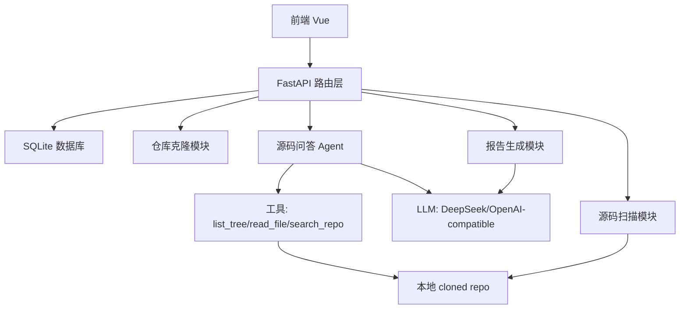
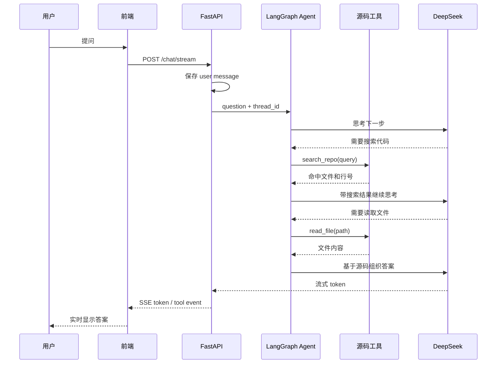

# Agent 工作流与架构设计

这份文档用一条主线来解释 project-helper 的工作方式：用户输入一个 GitHub 仓库地址后，系统如何克隆、扫描、生成报告，以及后续的源码问答 Agent 如何读取代码并给出回答。

项目里有两条容易混淆的链路：

- 项目分析报告流程：更像一个批处理管线，负责克隆仓库、扫描源码、生成 Markdown 报告。
- 源码问答 Agent 流程：真正的 LangGraph ReAct Agent，会按需调用工具搜索代码、读取文件，再基于源码回答问题。

## 总体架构



前端在 `frontend/src/composables/useProjectHelper.js` 里管理主要交互状态，包括创建项目、监听分析进度、加载源码树、发起问答、接收流式回答。

后端入口在 `backend/app/main.py`。它定义 API 路由，并把真正的业务工作交给 service、agent、database、source_scan 等模块。

## 项目分析报告流程

用户在前端输入 GitHub 仓库地址并点击分析后，前端先调用：

```text
POST /api/projects
```

后端会做三件事：

- 校验仓库地址，只允许配置里的 GitHub host。
- 用仓库 URL 生成稳定的 `project_id`。
- 把项目记录写入 SQLite，初始状态是 `created`。

这部分主要由 `backend/app/main.py` 和 `backend/app/repository.py` 负责。

随后前端打开 SSE 实时通道：

```text
GET /api/projects/{project_id}/analyze/stream
```

后端进入 `backend/app/services/analysis.py` 的 `analyze_project_stream()`，它是一个四阶段流水线：

```text
clone -> scan -> summarize -> save
```

### 1. clone: 克隆或更新仓库

后端调用 `clone_or_update()`，把目标 GitHub 仓库浅克隆到本地数据目录。如果之前已经克隆过，就 fetch 后 reset 到最新的 `origin/HEAD`。

这一步的目的很简单：先把远程仓库变成服务器本地的一份源码副本。后面的扫描、源码浏览、Agent 工具调用，全部基于这份本地副本工作。

### 2. scan: 静态扫描源码

后端调用 `backend/app/source_scan.py` 的 `scan_repository()`。它不会真正理解业务逻辑，而是做一组确定性的静态扫描：

- 统计可读源码文件数量。
- 识别技术栈，比如 FastAPI、Vue、LangChain。
- 找入口文件，比如 `main.py`、`App.vue`。
- 提取函数名和类名。
- 生成简化目录树。
- 读取 README 摘要。

扫描结果会变成一个 `summary` 字典，后续报告生成就基于这个摘要。

### 3. summarize: 生成报告

后端调用 `backend/app/agents/report_agent.py` 的 `generate_llm_report()`。

这里文件名叫 `report_agent`，但它不是会使用工具的 ReAct Agent，更准确地说，它是一个报告生成器。它把扫描结果塞进 `backend/app/prompts/report_prompt.md`，要求 LLM 输出固定结构的 JSON，然后再拼成 Markdown 报告。

如果没有配置 `DEEPSEEK_API_KEY`，系统会退化到 `local_report()`。这时不会调用 LLM，而是基于扫描结果生成一份模板报告。

### 4. save: 保存结果

报告生成后，后端把报告和扫描摘要保存到 SQLite，并把项目状态改成 `ready`。

前端收到 `done` 事件后，会重新拉取项目详情，然后显示报告、源码树和问答入口。

## 源码问答 Agent 流程

用户在问答区提问时，前端调用：

```text
POST /api/projects/{project_id}/chat/stream
```

这条路由在 `backend/app/main.py`，它先做几层校验和防护：

- 项目必须存在。
- 问题不能为空。
- 问题不能命中 prompt injection 检测。
- 最多引用 10 个文件。
- 先把用户消息写入 `chat_messages`。

然后后端进入 `backend/app/services/chat.py` 的 `chat_stream()`。

## Agent 的两种运行模式

### 配置了 LLM Key

如果配置了 `DEEPSEEK_API_KEY`，后端会调用 `backend/app/agents/code_agent.py` 的 `create_code_agent()` 创建 LangGraph ReAct Agent。

这个 Agent 的核心组成是：

```text
LLM + system prompt + tools + checkpointer
```

LLM 来自 `backend/app/llm.py`，本质是 `ChatOpenAI`，但 `base_url` 默认指向 DeepSeek：

```text
DEEPSEEK_BASE_URL=https://api.deepseek.com
DEEPSEEK_MODEL=deepseek-chat
```

system prompt 在 `backend/app/prompts/agent_system_prompt.md`，要求 Agent 必须基于工具读取到的源码回答，不要凭空猜测；需要时先搜索，再读取文件。

Agent 可用的工具有三个：

- `list_tree()`：列出项目目录树。
- `read_file(path)`：读取仓库内指定文件。
- `search_repo(query)`：全文搜索代码。

这些工具分别定义在 `backend/app/tools/file_ops.py` 和 `backend/app/tools/search.py`。

一次典型问答大概是这样：



### 没有配置 LLM Key

如果没有配置 `DEEPSEEK_API_KEY`，`create_code_agent()` 会返回 `None`。

这时系统不会创建 Agent，而是走本地 fallback：从问题里拆关键词，调用 `search_code()` 搜一下代码，然后把搜索结果流式返回给用户。

这种模式不能真正理解上下文，但至少能给用户一些可验证的源码线索。

## 工具边界与安全设计

Agent 不直接访问整个服务器文件系统，只能通过受控工具访问当前项目的 cloned repo。

`read_repo_file()` 会做路径安全检查：

```text
root = 仓库根目录
target = root / 用户请求路径
确认 target 仍然在 root 里面
```

这样可以防止用户让 Agent 读取类似下面这种仓库外文件：

```text
../../etc/passwd
```

源码浏览接口也有类似保护，集中在 `backend/app/source_scan.py`：

- 拒绝符号链接。
- 拒绝仓库外路径。
- 拒绝非文本文件。
- 拒绝过大文件。

这个设计的核心思想是：Agent 可以很聪明，但它能碰到的东西必须被工具边界限制住。

## 记忆与历史记录

项目里有两套“记忆”，它们解决的问题不同。

第一套是数据库里的聊天历史。

`backend/app/database.py` 里有 `chat_messages` 表，保存用户和助手的完整文本。前端加载项目时，会调用：

```text
GET /api/projects/{project_id}/chat/messages
```

第二套是 LangGraph 的运行时 checkpointer。

`backend/app/memory/checkpointer.py` 使用 `MemorySaver()`，并用 `project_id` 作为 `thread_id`。这让同一个项目里的多轮 Agent 对话可以共享上下文。

不过当前 `MemorySaver` 是内存型的。容器重启后，LangGraph 的内部状态会丢；数据库里的聊天文本仍然存在。这是当前架构的一个重要边界。

## 数据库模块

当前项目使用 SQLite，不是 MySQL 或 PostgreSQL。

数据库文件路径来自配置：

```text
PROJECT_HELPER_DATA_DIR=/app/data
db_path=/app/data/project_helper.sqlite3
```

数据库主要存三类数据：

- `projects`：项目、仓库 URL、状态、报告、扫描摘要。
- `source_annotations`：源码批注。
- `chat_messages`：问答历史。

这个选择的好处是部署简单，单容器直接能跑。限制是如果以后要多实例部署，SQLite 就不太合适，需要迁到 PostgreSQL 这类服务型数据库。

## 前端如何接收流式内容

分析报告流程用 `EventSource`，因为它是 GET SSE：

```text
GET /api/projects/{id}/analyze/stream
```

问答流程用 `fetch + ReadableStream`，因为它是 POST，需要带问题正文：

```text
POST /api/projects/{id}/chat/stream
```

后端发出的事件主要有：

- `progress`：分析进度。
- `cached`：命中缓存。
- `done`：完成。
- `failed`：失败。
- `token`：LLM 输出的文字片段。
- `agent`：工具调用开始或结束。

所以前端能一边显示“Agent 正在 search_repo/read_file”，一边逐字显示回答。

## 一句话总结

project-helper 的设计可以概括成：

```text
Vue 前端负责交互和流式展示
FastAPI 负责 API、SSE 和流程编排
SQLite 负责缓存项目、报告、批注、聊天记录
source_scan 负责把仓库变成结构化摘要
report_agent 负责把摘要生成新手友好的报告
code_agent 才是真正的 LangGraph ReAct Agent，靠工具搜索和读取源码后回答问题
```

它的核心思路是：先把代码仓库本地化，再把“读目录、搜代码、读文件”封装成安全工具，最后让 Agent 在这些工具边界内工作。这样既能让回答尽量基于真实源码，也避免 Agent 越权访问服务器上的其他文件。
